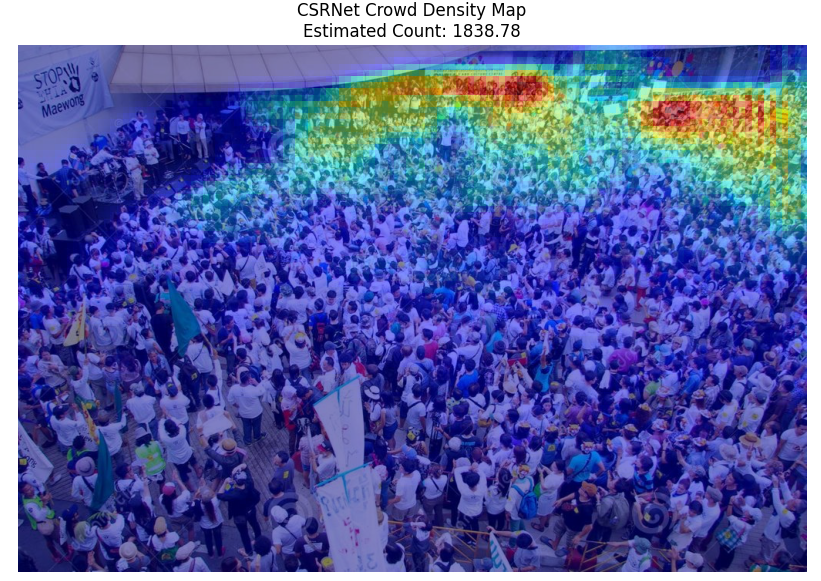
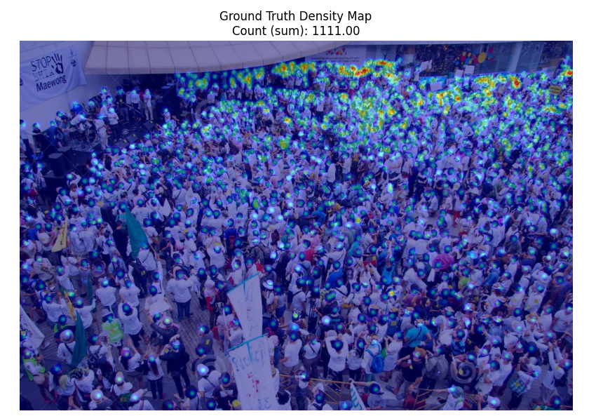

# Crowd Density Estimation

## Overview

This repo contains a Python implementation of **CSRNet** compatible with checkpoints from [CSRNet-pytorch](https://github.com/leeyeehoo/CSRNet-pytorch/tree/master)

Output types should be trivial to determine since I added typing

**Current features**
- Load and preprocess RGB images for the network (ImageNet mean/std, batched tensors).
- Load pretrained CSRNet weights and run inference to get a density map and an estimated count (sum of the map).
- Load ShanghaiTech-style ground truth from `.mat` files (head locations) and build a smoothed density map for comparison or visualization.
- Optionally blur density maps
- Plot predicted density, ground-truth density, or a generic overlay on the original image (`plotting_tools.py`);


## Installation
```pip install -r requirements.txt```

The models should be downloaded from the git repo and placed in the models/csr_net_base folder. Delete the .tar extension. it's not actually a tarball. Idk why it's labeled like that.

Note: This is tested and working on Python 3.11.13 

## Training

Training is driven by `train.py`, which builds **`CSRNet` from `csrnet.py`**, loads data through **`dataset.py`**, and saves checkpoints with **`utils.save_checkpoint`**.

### Data layout and JSON files

- **`train_json` / `test_json`**: paths to JSON files. Each file must decode to either:
  - a **list of image paths** (strings), or
  - a **list of objects** with an `"img"` field pointing to each RGB image (e.g. ShanghaiTech `images/IMG_42.jpg`).
- **Ground truth** for each image is resolved in this order:
  1. **HDF5** (CSRNet-pytorch style): same basename as the image, `.h5` instead of `.jpg`, under a `ground_truth` directory in place of `images` (e.g. `.../ground_truth/IMG_42.h5` with dataset `density`).
  2. Otherwise **`GT_<stem>.mat`** next to the usual ShanghaiTech layout: `.../ground_truth/GT_<stem>.mat`, loaded with **`load_ground_truth`** in `csrnet.py` (head points → Gaussian density, then downsampled for training).

The dataset follows the common CSRNet convention: the full-resolution density map is **spatially reduced by 8×** (to match the network stride after three max-pool stages) and **scaled by 64**, so the map remains comparable to the original CSRNet-pytorch training recipe.

### What the training loop does

- **Model**: `CSRNet(load_weights=False)` initializes the frontend from **ImageNet VGG16** weights (see `csrnet.py`), then trains the full network.
- **Input preprocessing**: ImageNet mean/std normalization (same as inference).
- **Loss**: **MSE** with `reduction="sum"` between the predicted density map and the target map. If the target’s height/width does not exactly match the network output (e.g. odd image sizes), the target is **bilinearly resized** to the output size and **rescaled** so its sum (approximate crowd count) is unchanged.
- **Optimization**: SGD with momentum and weight decay; learning rate is adjusted by `adjust_learning_rate` (piecewise schedule from `steps` / `scales` in `train.py`).
- **Validation**: reports **MAE** as the mean absolute error between the **sum of the predicted map** and the **sum of the ground-truth map** per batch (count error), averaged over the val loader.
- **Checkpoints**: each epoch saves `checkpoint.pth.tar` under the **`task`** prefix; the best MAE run is also copied to `model_best.pth.tar`. **`load_csrnet_model`** in `csrnet.py` can load these files via the `state_dict` entry.

### Example command

```bash
python train.py path/to/train.json path/to/val.json 0 ./runs/exp1_ --epochs 400
```

Here `0` is `CUDA_VISIBLE_DEVICES` (pick the GPU index you want, e.g. `0`), and `./runs/exp1_` is the **`task`** prefix prepended to checkpoint filenames (create the directory beforehand if you want a subfolder). Use **`--epochs N`** to change run length (default `400`). Optional **`--pre /path/to.pth`** resumes from a checkpoint saved by this script or a compatible CSRNet checkpoint. If no CUDA device is visible, training runs on **CPU** (slower but useful for smoke tests).

## Example
```python
from pathlib import Path

from csrnet import load_and_process_image_with_csrnet, load_csrnet_model, load_ground_truth
from plotting_tools import plot_csrnet_density_map, plot_ground_truth_density


def example():
    weights_a = Path("./models/csr_net_base/PartBmodel_best.pth")
    img_path = Path("./ShanghaiTech_Crowd_Counting_Dataset/part_A_final/test_data/images/IMG_2.jpg")

    if not img_path.exists():
        print(f"Warning: Could not find {img_path}. Make sure the image exists to run the example.")
        return

    model = load_csrnet_model(weights_a, map_location="cpu")
    img, density_map, estimated_crowd_count = load_and_process_image_with_csrnet(model, img_path)

    gt_path = img_path.parent.parent / "ground_truth" / f"GT_{img_path.stem}.mat"
    if gt_path.exists():
        gt_density = load_ground_truth(gt_path, image_path=img_path)
        plot_ground_truth_density(img, gt_density)

    plot_csrnet_density_map(img, density_map, estimated_crowd_count)
```

This should produce plots like the ones below




## Shanghai Tech Density Dataset
A dataset of labeled single crowd images split into two folders containing
- images: the jpg image file
- ground-truth: matlab file containing head annotations (coordinate x, y)
- ground-truth-h5: people density map 
- part_A contains dense crowd images
- part_B contains sparse crowd images

## CRSNet
congested scene recognition (CSRNET): a CNN that accepts images of arbitrary size input and outputs a 2D crowd density estimation map

Roughly, it hsa the following architecture: It is basically VGG-16 without the fully connected classifier, plus a dilated-convolution back end. The front end uses the first 10 convolution layers of VGG-16 with 3 max-pooling layers, so its feature map is 1/8 of the input resolution. The back end processes that output with six dilated 3x3 convolutions. The final result is an output with the same size as the input.

VGG: An image focused CNN architecture that uses lots of small 3x3 convolutions with occasional max pooling layers
Max Pooling Layers: Reduce dimensionality by selecting the largest number in a grid


## Notes for Clara
- Training was, at first, done on the shanghai_A dataset for about 20 epochs (testmodel_best.pth was the result). Next, I started running 

- check the figures/outputs folder for example runs with different models (split into folders by model)

- There are also some notes in [The Training README](training/README.md) about the training data and hyperparameters.